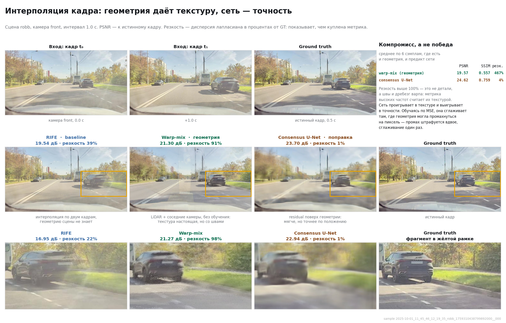
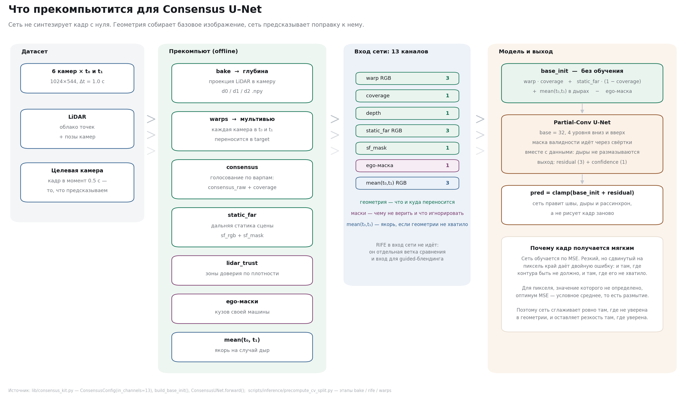

# Интерполяция кадров на многокамерном датасете

Синтез кадра целевой камеры в промежуточный момент времени: на вход — surround-камеры
в моменты `t0` и `t1` плюс агрегированное облако точек LiDAR, на выход — предсказанный
кадр между ними.

**Пайплайн:** baseline-методы → LiDAR parallax → consensus U-Net → ego-маски →
test inference → submission.

**Стек:** Python, PyTorch (U-Net «consensus»), OpenCV (Farneback / DIS optical flow),
RIFE (нейросетевая интерполяция), Ultralytics YOLO26 (детекция / сегментация / семантика),
проекция LiDAR и карты глубины.

## Результат



Геометрия и сеть решают разные части задачи. Перенос по LiDAR даёт настоящую текстуру,
но оставляет швы там, где соседние камеры не сходятся. Сеть предсказывает поправку поверх
этой геометрии и обучается по MSE — а MSE штрафует сдвиг контура на пиксель вдвое, тогда
как сглаживание один раз. Поэтому она отдаёт часть резкости и забирает точность: на 6 сэмплах
PSNR 24.62 против 19.57 дБ и SSIM 0.759 против 0.557 у чистой геометрии.

Как считались метрики, почему «резкость выше 100%» означает артефакты и какие оговорки есть
у этих чисел — в [docs/RESULTS.md](docs/RESULTS.md).

## Как устроен вход сети



Сеть не синтезирует кадр с нуля. Прекомпьют собирает 13 каналов — перенос по глубине,
карту покрытия, глубину, дальнюю статику, маски LiDAR-доверия и кузова, усреднение `t₀`/`t₁` —
из них геометрия складывает `base_init`, а U-Net предсказывает `residual` к нему.

## Документация

| Файл | Содержание |
|------|------------|
| [PROJECT_MAP.md](PROJECT_MAP.md) | **Начать отсюда:** что за проект и в каком порядке идёт пайплайн |
| [docs/REPO_LAYOUT.md](docs/REPO_LAYOUT.md) | Структура репозитория и правила раскладки |
| [docs/TEST_INFERENCE_PIPELINE.md](docs/TEST_INFERENCE_PIPELINE.md) | Test inference end-to-end |
| [docs/CONSENSUS_V3.md](docs/CONSENSUS_V3.md) | Обучение consensus U-Net |
| [docs/README_CV_DATASET.md](docs/README_CV_DATASET.md) | Формат датасета |
| [docs/README_YOLO.md](docs/README_YOLO.md) | YOLO-аннотации |
| [analytics/README.md](analytics/README.md) | Стратифицированная оценка ошибок |

## Структура

```
lib/          реализация: consensus U-Net, LiDAR-глубина, parallax, маски
scripts/      точки входа по этапам: inference / training / ego / baselines / tuning / stage2
notebooks/    обучение и эксперименты
configs/      пути к данным и подобранные параметры
docs/         документация
analytics/    оценка ошибок + HTML-отчёт
yolo/         YOLO26-пайплайны для семантики
viewer/       локальный просмотрщик результатов
```

Восемь `.py` в корне (`consensus_kit.py`, `lidar_*.py`, `layered_parallax.py`,
`mega_parallax.py`, `static_mask.py`, `ego_mask_*.py`) — тонкие реэкспорты из `lib/`,
чтобы работал короткий `from consensus_kit import ...`. Реализации там нет.

## Запуск (test)

```bash
python scripts/inference/precompute_cv_split.py --split test
python scripts/inference/run_test_consensus_inference.py
python scripts/inference/run_test_blend_blur.py --force
python scripts/inference/export_submission_blend50.py
```

Ego-маски (ручной выбор через локальный picker):

```bash
python scripts/ego/export_mask_composer.py --test-only
python scripts/ego/serve_mask_picker.py      # http://127.0.0.1:8765/composer_test.html
python scripts/ego/import_mask_picker_selections.py
```

## Данные

Полный датасет (`final_dataset_v5_participants`, ~320 ГБ) в репозитории не лежит.
Пути задаются в [`ya_paths.py`](ya_paths.py) и [`configs/dataset.yaml`](configs/dataset.yaml),
переопределяются переменной окружения `YA_CV_DATASET`.

Формат сэмпла показан на маленькой выборке в [`dataset_sample/`](dataset_sample/):
6 сцен, для каждой — 6 камер в `t0` и `t1`, целевой кадр и `meta.json`.

Веса U-Net, экспорт галерей методов и клон RIFE тоже вне git — см.
[«Чего в репозитории нет и почему»](docs/REPO_LAYOUT.md#чего-в-репозитории-нет-и-почему).
